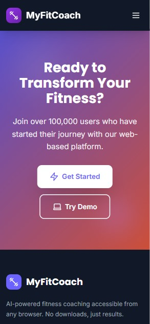
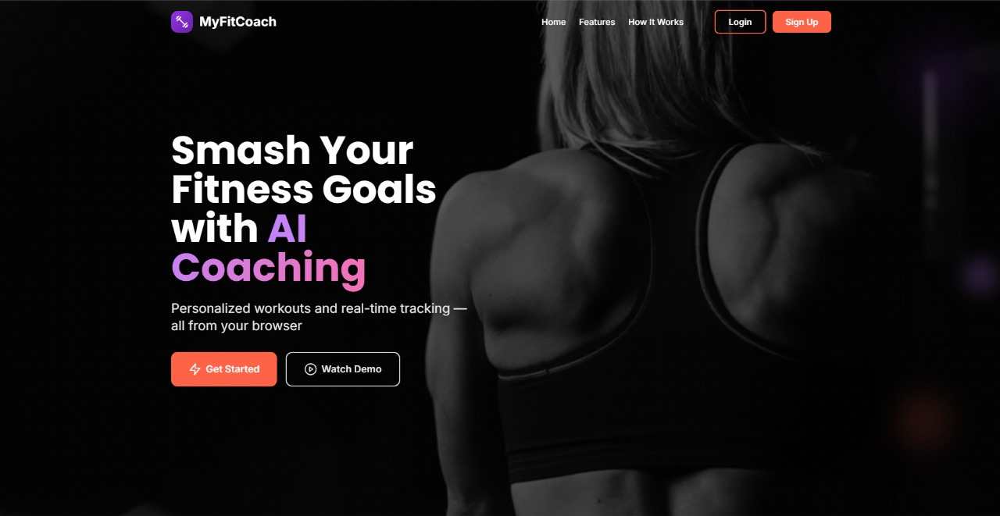

# MyFitCoach 

**MyFitCoach** is an AI-powered fitness coaching web application designed to help users achieve their health and wellness goals.  
It combines personalized workout and nutrition tracking with interactive AI coaching, goal planning, and progress monitoring — all in one platform.

🌐 **Live Demo:** [www.myfitcoach.org](http://www.myfitcoach.org)

---

## 📱 Mobile View & 🖥️ Desktop View  

| **Mobile View** | **Desktop View** |
|-----------------|------------------|
|  |  |

## 🚀 Features

###  AI-Powered Fitness Coach
- Get personalized training and nutrition guidance from an intelligent virtual coach.
- Tailored recommendations based on your progress and goals.

###  Dashboard Overview
- Centralized view of all your fitness activities, progress, and upcoming plans.

###  Workout Tracker
- Create, edit, and track workout routines.
- Log exercises, sets, reps, and durations.

###  Nutrition Tracker
- Record daily meals and nutritional intake.
- Monitor calories, macros, and meal history.

###  Planner & Scheduler
- Organize workouts, meals, and fitness activities with an easy-to-use planner.

###  Progress Tracker
- Visualize progress with charts and graphs.
- Track improvements in strength, endurance, and body measurements.

###  Premium Membership
- Free trial (3 uses) for AI Coach.
- Exclusive plans & features for premium users.
- Discount codes supported (Free, 30%, 50% off).

---

## 🛠️ Tech Stack

**Frontend:**
- React.js
- Modern UI with responsive design

**Backend:**
- Serverless 
- Supabase (Database, Authentication, and API)
- Stripe (Payments & Subscription Management)

**Other Tools & Libraries:**
- Chart.js for progress visualization
- Bootstrap / Tailwind CSS for styling

---

